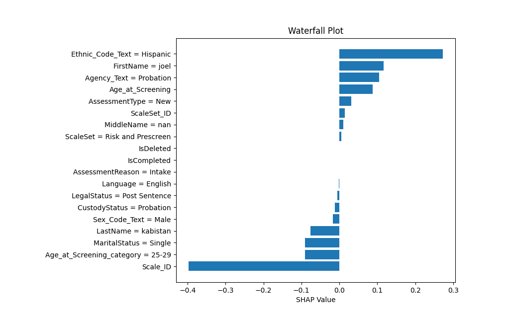

# Unveiling the Black Box
Oleksandr Horban\
August 2023\
Claremont McKenna College

## Abstract

## Introduction
As Machine Learning models became more and more sophisticated to adapt to a growing amount of data, humans' ability to understand why these models make decisions that they make decreased. Trying to interpret a decision tree is very different from trying to interpret a deep neural network, that from the outside perspective looks like a **black box**. All we know is that data comes in and magically an answer comes out. Trying to understand what each neuron is doing will get you a one-way ticket to having a mental breakdown. This becomes a problem when interpreting a decision made by a machine learning model becomes a critical step. Consider, for example, working on a problem of binary classification of apples and oranges. Your deep neural network can learn from millions of pictures and be able to differentiate apples from oranges with 99% accuracy. One percent of apples are labeled as oranges, not the end of the world, right? In contrast, consider a risk assessment model that classifies whether the defendant should or should not be sentenced to life in prison. Now, the 1% percent of wrongfully incarcerated inmates carries a much higher price. To top it all off, we can't even tell why our model made the decision to put that 1% of people in jail. It could be the number of crimes they committed in the past, or it could be their race. In such cases understanding why the machine learning model made the decision that it did is very crucial. In reality, such an algorithm exists and is making the decision of putting people in jail. It is called COMPAS and was made by Northpointe. In this paper, I will explain techniques for ML interpretability and run through the example of applying such techniques in the criminal justice system with the hopes of improving algorithms such as COMPAS.

## Interpretable Models
There are machine learning models that make interpretability an easy task. Linear regression, logistic regression and the decision tree are commonly used interpretable models. For models like these, it is fairly easy to understand why the model made the decision that it did.
### Linear Regression

1. **Simplicity**: Linear Regression models the relationship between a dependent variable \( y \) and one or more independent variables \( X \) using a linear equation. This equation is intuitive and easy to understand.

2. **Interpretability of Coefficients**: The coefficients of the linear regression model represent the change in the output for a one-unit change in the corresponding input. This provides a straightforward way to interpret the importance of each variable.

3. **Global Model Interpretation**: Linear regression provides a global interpretation of the model since it defines a single relationship across the entire data space, unlike more complex models that might have local interpretations. (more about this in following chapters)

4. **Transparency**: The mechanics of linear regression are well-understood, and there are no hidden layers or complex structures that are hard to interpret, as is the case with some neural networks.

5. **Visual Representation**: It's possible to visualize the linear model in two or three dimensions, which aids in understanding.

The general formula for a simple linear regression (one independent variable) is:

$$ y = \beta_0 + \beta_1 x + \epsilon $$

where:
- $y$ is the dependent variable
- $\beta_0$ is the intercept
- $\beta_1$ is the slope of the line
- $x$ is the independent variable
- $\epsilon$ is the random error term

For multiple linear regression, where there are more than one independent variables, the equation extends to:

$$ y = \beta_0 + \beta_1 x_1 + \beta_2 x_2 + \ldots + \beta_p x_p + \epsilon $$

Again, the coefficients $\beta_i$ give you the change in the dependent variable for a one-unit change in the corresponding independent variable.

To find the coefficients, a common method is to minimize the sum of squared residuals, given by the formula:

$$ \min_{\beta} \sum_{i=1}^{n} \left( y_i - \left( \beta_0 + \beta_1 x_{i1} + \beta_2 x_{i2} + \ldots + \beta_p x_{ip} \right) \right)^2 $$

All of these characteristics make linear regression a transparent, interpretable, and thus a good model in terms of explainable AI.

### Logistic Regression

1. **Simplicity**: Similar to Linear Regression, Logistic Regression models the relationship between a dependent variable \( y \) and one or more independent variables $X$, but it's used for binary classification. The relationship is represented using the logistic function, which maps any real-valued number into the range of [0,1].

2. **Interpretability of Coefficients**: The coefficients in Logistic Regression represent the log odds of the dependent event happening, so they can be interpreted in a probabilistic context. A one-unit change in the predictor variable results in a change in the log odds of the outcome variable by the amount of the coefficient.

3. **Global Model Interpretation**: Like Linear Regression, Logistic Regression defines a single relationship across the entire data space, offering a global interpretation.

4. **Transparent Probabilistic Interpretation**: The model estimates the probability of a class label using the logistic function, providing a clear understanding of what the model's output represents.

5. **No Hidden Complexity**: Logistic Regression is also free of complex structures like hidden layers in neural networks, enhancing its transparency.

The general formula for logistic regression is:

$$ p(y=1|X) = \frac{1}{1 + e^{-(\beta_0 + \beta_1 x_1 + \beta_2 x_2 + \ldots + \beta_p x_p)}} $$

where:
- $p(y=1|X)$ is the predicted probability that $y = 1$ given the predictor variables $X$
- $\beta_0, \beta_1, \beta_2, \ldots, \beta_p$ are the coefficients
- $e$ is the base of the natural logarithm
- $x_1, x_2, \ldots, x_p$ are the predictor variables

The logit transformation is the inverse of the logistic function and provides a linear combination of the predictor variables:

$$ \text{logit}(p) = \log \left( \frac{p}{1-p} \right) = \beta_0 + \beta_1 x_1 + \beta_2 x_2 + \ldots + \beta_p x_p $$

The coefficients can be estimated by maximizing the likelihood function, or equivalently, minimizing the negative log-likelihood:

$$ \min_{\beta} -\sum_{i=1}^{n} \left( y_i \log(p_i) + (1 - y_i) \log(1 - p_i) \right) $$

where $p_i$ is the predicted probability for observation $i$, and $y_i$ is the actual outcome.

Like Linear Regression, the transparency and simplicity of Logistic Regression make it a desirable choice in contexts where interpretability is essential.

### Decision Tree

1. **Intuitive Representation**: Decision Trees model data by partitioning the feature space into regions and assigning a prediction to each region. This structure can be easily visualized and understood as a flowchart or tree diagram.

2. **Interpretability of Decision Rules**: Each internal node of the tree represents a decision rule that splits the data based on a feature and a threshold. These rules are easy to interpret and describe.

3. **Global and Local Interpretation**: Decision Trees provide both global interpretation (the overall structure of the tree) and local interpretation (the path leading to a particular decision).

4. **Transparency**: The workings of a Decision Tree are entirely transparent, with no hidden calculations or assumptions.

A Decision Tree is typically represented as a binary tree, where:

- The **internal nodes** represent a decision rule based on a feature $x_j$ and threshold $t$: $x_j < t$.
- The **branches** represent the outcome of the test, leading to either a decision (another test) or a leaf node.
- The **leaf nodes** represent the prediction, either a class label (for classification) or a value (for regression).

The construction of a Decision Tree typically involves recursively splitting the data based on a criterion that maximizes information gain (for classification) or minimizes mean squared error (for regression).

The information gain for a split on feature $x_j$ with threshold $t$ for classification can be calculated as:

$$ \text{IG}(S, x_j, t) = \text{Entropy}(S) - \sum_{v \in \{L, R\}} \frac{|S_v|}{|S|} \text{Entropy}(S_v) $$

where $S$ is the set of samples at the current node, $S_v$ is the subset of samples that go to child node $v$, and $L, R$ are the left and right child nodes.

For regression, a common criterion is the mean squared error, calculated as:

$$ \text{MSE}(S) = \frac{1}{|S|} \sum_{i \in S} (y_i - \bar{y})^2 $$

where $y_i$ is the target value for sample $i$, and $\bar{y}$ is the mean target value for samples in $S$.

The intuitive nature, interpretability, and transparency of Decision Trees contribute to their status as a strong model in the context of explainable AI.

## Local Model-agnostic Methods
Once we get to more complicated models such as XGBoost or Neural Networks, global interpretabiliy becomes a more complicated task, which is why we need to come up with better ways to intepret the model. **Local explainability** methods explain the behavior of the model at a specific data point (individual prediction). **Model-agnostic** methods can be applied to any machine learning model, regardless of its internal workings. They don't require access to the model's architecture, parameters, or training data.

### LIME (Local Interpretable Model-agnostic Explanations)
LIME (Local Interpretable Model-agnostic Explanations) is a technique that helps to explain the predictions of a complex machine learning model (the "black box"). It does this by constructing a **surrogate model**, which is a simpler, interpretable model that approximates the black box's behavior for a specific instance or local region. Here's how LIME utilizes a surrogate model:

1. **Select an Instance**: Choose a specific data point (instance) that you want to understand.

2. **Generate Perturbed Samples**: Create variations (perturbed samples) of this instance by altering its features slightly.

3. **Get Predictions for Perturbed Samples**: Input the perturbed samples into the black box model to obtain predictions.

4. **Weight the Perturbed Samples**: Assign a weight to each perturbed sample based on its similarity to the original instance, using a kernel function:

$$ w_i = \exp\left(-\frac{{\|x - x_i\|^2}}{{\sigma^2}}\right) $$

5. **Train a Surrogate Model**: Using the perturbed samples, their weights, and the black box model's predictions, train a surrogate model, such as Linear Regression, Logistic Regression or a Decision Tree.

6. **Analyze the Surrogate Model**: By examining the surrogate model's structure and decision rules, you gain insights into why the black box model made its specific prediction for the original instance.

7. **Local Fidelity**: The surrogate model's accuracy, or "local fidelity," is expected to be good only for instances close to the original one. It's not a global approximation of the black box model but rather a local reflection of its behavior.

By employing a surrogate model, LIME makes it possible to analyze and trust the predictions of complex models, facilitating their use in critical applications where understanding the reasoning behind predictions is essential.

### Shapley Values
Shapley Values originate from cooperative game theory and have been adapted to explain the output of machine learning models. They provide a unified measure of feature importance by fairly distributing the "contribution" of each feature to a prediction.

Shapley Values explain how much each feature in your dataset contributes to a particular prediction. Think of a prediction as a game where each feature is a player, and the Shapley Value is the fair payout for each player, considering all possible combinations they can play in.

The Shapley Value ensures that the total contribution of all features equals the difference between the prediction for the instance and the average prediction for all instances. The "fair" distribution follows three principles:
   - **Efficiency**: The total Shapley Values for all features add up to the total effect.
   - **Symmetry**: If two features contribute equally, their Shapley Values are the same.
   - **Linearity**: The Shapley Value of a combined game equals the sum of the Shapley Values of the individual games.

The Shapley Value for a feature \(i\) is computed as:

$$ \phi_i(f) = \sum_{S \subseteq N \setminus \{i\}} \frac{{|S|!(|N|-|S|-1)!}}{{|N|!}} [f(S \cup \{i\}) - f(S)] $$

Where:
- $N$: The set of all features.
- $S$: A subset of features without feature $i$.
- $f(S)$: The prediction made by the model with only the features in $S$.
- $f(S \cup \{i\})$: The prediction made by the model with the features in $S$ plus feature $i$.
- $|S|$: The number of features in $S$.
- $|N|$: The total number of features.

Shapley Values provide a consistent way to interpret model predictions by quantifying the contribution of each feature. They are particularly useful for:
- **Understanding Individual Predictions**: Breaking down the prediction for a specific instance into the contribution of each feature.
- **Global Importance**: Averaging Shapley Values over many instances to understand overall feature importance (this process is called SHapley Additive exPlanations or SHAP for short and will be discussed in the following chapter)
- **Fairness and Transparency**: Providing a "fair" explanation that meets certain desirable mathematical properties.

Computing Shapley Values can be computationally intensive, as it requires evaluating the model for all possible subsets of features. Various approximations and optimized algorithms have been developed to make the computation more tractable for large datasets and complex models.

## Global Model-agnostic Methods
Ideally, we would want to give a general overview about how a model is making predictions for all data points, not just locally. For that there exist Global methods of interpretation.

### SHAP (SHapley Additive exPlanations)
SHAP (SHapley Additive exPlanations) is a method that leverages Shapley Values to explain the output of any machine learning model. SHAP unifies several existing feature attribution methods and provides a consistent approach to interpreting model predictions.

SHAP is based on Shapley Values from cooperative game theory. It calculates the fair contribution of each feature to a prediction, considering all possible combinations of features.

SHAP assigns each feature an importance value for a particular prediction that is additive. The sum of the SHAP values for all features equals the difference between the model's prediction and the average prediction for all instances.

For a given instance and prediction model, the SHAP value for feature $i$ is computed similarly to the Shapley Value:

$$ \text{SHAP}_i(f) = \sum_{S \subseteq N \setminus \{i\}} \frac{{|S|!(|N|-|S|-1)!}}{{|N|!}} [f(S \cup \{i\}) - f(S)] $$

Where:
- $N$: The set of all features.
- $S$: A subset of features without feature $i$.
- $f(S)$: The prediction made by the model with only the features in $S$.
- $f(S \cup \{i\})$: The prediction made by the model with the features in $S$ plus feature $i$.
- $|S|$: The number of features in $S$.
- $N|$: The total number of features.

SHAP values provide insights into:
- **Individual Predictions**: How each feature contributes to a particular prediction.
- **Global Importance**: The overall importance of features across many predictions.
- **Impact of a Feature's Value**: How a feature's value contributes positively or negatively to a prediction.

Computing exact SHAP values can be computationally expensive. Several algorithms, such as Kernel SHAP and Tree SHAP, have been developed to approximate SHAP values more efficiently. These leverage specific model structures or kernel methods to provide accurate approximations with lower computational cost.

SHAP comes with various visualization tools that allow users to visually interpret both individual predictions and global feature importance. Examples include SHAP summary plots, dependence plots, and waterfall plots.

## Risk Assessment
Risk-assessment algorithms in the justice system are statistical tools designed to forecast an individual's likelihood of reoffending. These algorithms analyze various factors, such as criminal history, age, employment status, and sometimes even personality traits, to generate a score that represents the defendant's risk to society. Utilized in courtrooms across the United States and other countries, they are implemented at various stages of the criminal justice process, including pre-trial, sentencing, and parole decisions. Proponents of these tools argue that they can bring consistency and objectivity to legal proceedings, aid in reducing overcrowded prison populations, and facilitate individualized sentencing. However, critics raise significant concerns about their transparency, accuracy, potential for bias, especially racial disparities, and the ethical implications of relying on machine-driven decisions in matters of criminal justice. The integration of risk-assessment algorithms into the legal system marks a complex intersection between technology, law, and social responsibility, and continues to be a subject of debate and scrutiny.

Explainable AI (XAI) is a critical concept that can be applied to risk-assessment algorithms in the justice system to address some of the challenges and concerns surrounding their use. Unlike traditional "black box" models where the decision-making process is hidden, XAI aims to make AI decisions transparent, interpretable, and understandable to human users. By incorporating explainable AI into risk-assessment algorithms, the justice system could provide clear insights into how these tools derive their risk scores. This increased transparency could promote trust among judges, lawyers, and the public and might also enable the identification and mitigation of any underlying biases, such as racial disparities. Furthermore, explainable models can facilitate compliance with legal and ethical standards, allowing for proper scrutiny and challenge in court. In essence, explainable AI offers a pathway to more responsible and accountable use of machine learning in the justice system, bridging the gap between technological innovation and the principles of fairness, equality, and human rights that underpin legal practice. It can help ensure that these algorithms are not just tools for efficiency, but also instruments that uphold the integrity and humanity of the legal process.

### The Data
For this project, I referred to a [dataset](https://github.com/propublica/compas-analysis) posted by the [official ProPublica GitHub page](https://github.com/propublica). ProPublica is an independent, non-profit newsroom that produces investigative journalism in the public interest. They were the ones who originally performed the analysis of risk assessment tools in the justice system and [reported their findings](https://www.propublica.org/article/how-we-analyzed-the-compas-recidivism-algorithm).
The dataset was [origianally obtained](https://www.propublica.org/article/how-we-analyzed-the-compas-recidivism-algorithm#:~:text=Through%20a%20public%20records%20request%2C%20ProPublica%20obtained%20two%20years%20worth%20of%20COMPAS%20scores%20from%20the%20Broward%20County%20Sheriff%E2%80%99s%20Office%20in%20Florida.%20We%20received%20data%20for%20all%2018%2C610%20people%20who%20were%20scored%20in%202013%20and%202014.) by ProPublica throught a public record request.
The data shows COMPAS scores and information about individuals who were scored between 2013 and 2014 in the Broward County, Florida. These scores were used to determine whether to release or detain a defendant before their trial.

I trained an XGBoost model to predict the defendants COMPAS score based on the outputs of the original risk-assessment algorithm and applied SPAH analysis to show what features where the most important when making a prediction about whether a person is going to reoffend in the future. Ideally, I would have access to the original data used for training COMPAS.

Visit [xgboost_explain_predict.py](xgboost_explain_predict.py) for implementation details.

One of the interesting findings is that the most predictive feature of a person being classified as Medium risk of reoffending is purely being hispanic:

### Ethical Considerations
Having race as one of the main predictors of the COMPAS score is slightly unexpected, since  Northpointe does not use person's race in the training of the model due to legal concerns. That would mean that our approach indicates that Hispanics commit more crime than other races and therefore that feature would increase a risk score for Hispanics.
Another possibility is that, while race specifically is not used for model training, there mights other used features that are highly correlated with the person's race. For example, if Northpointe would to use person's zip code as one of the features for training their model, then due to housing segregation, that would be almost the same as using person's race as an input.

## Resources
1. Interpretable Machine Learning, Christoph Molnar, https://christophm.github.io/interpretable-ml-book/
1. Machine Bias, Julia Angwin, Jeff Larson, Surya Mattu and Lauren Kirchner, ProPublica, May 23, 2016, https://www.propublica.org/article/machine-bias-risk-assessments-in-criminal-sentencing
1. Compas Analysis, ProPublica, https://github.com/propublica/compas-analysis